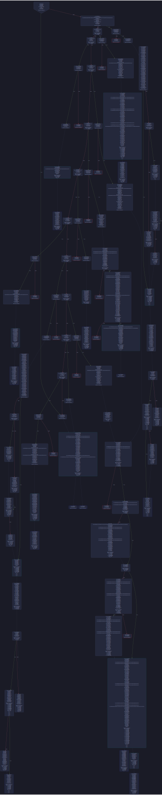
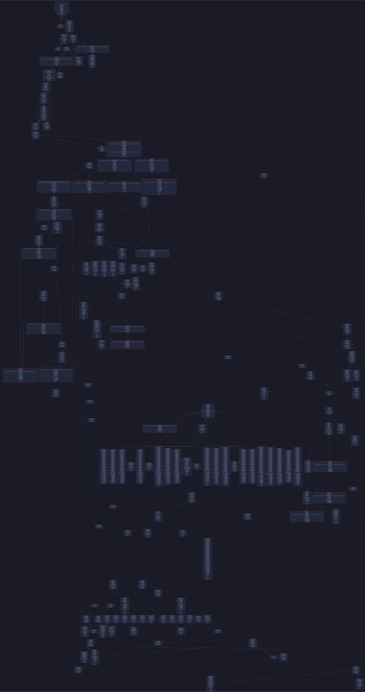
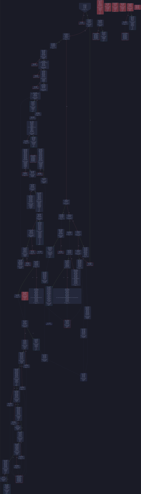

# EVM CFG
A fast and accurate CFG generator for EVM bytecode using symbolic stack analysis. View the [graph visuals](#example-outputs) below.


## Installation
First, make sure rust is installed:
```bash
curl --proto '=https' --tlsv1.2 -sSf https://sh.rustup.rs | sh
```

Then:
```bash
git clone https://github.com/plotchy/evm-cfg
cd evm-cfg/
cargo install --path . --locked
evm-cfg <PATH_OR_BYTECODE> -o cfg.dot --open
```

For working with .dot files, I recommend using the below VSCode extension as it allows powerful graph searching and filtering:
```
Name: Graphviz Interactive Preview
Id: tintinweb.graphviz-interactive-preview
Description: Graphviz (dot) Interactive Preview
Version: 0.3.5
Publisher: tintinweb
VS Marketplace Link: https://marketplace.visualstudio.com/items?itemName=tintinweb.graphviz-interactive-preview
```
- Text search is useful for finding push values and pc values
- Path filtering is available (can shade all nodes that are not part of a path)
  - useful to visually prune the graph of nodes belonging to other functions that are not part of the path you are interested in 

For minimal dependencies, you can convert the .dot file to a .svg picture for viewing:
```bash
evm-cfg ./examples/weth9.evm --open

# which is equivalent to:
evm-cfg ./examples/weth9.evm -o ./examples/cfg_weth.dot;
dot -Tsvg ./examples/cfg_weth.dot -o examples/weth9.svg;
open examples/weth9.svg;
```


## How It Works In Phases:
### Disassembly
Using static analysis, we can split the bytecode up into a structure representable by a graph. The following is done before executing any opcodes through a vm:
- provides contiguous blocks of instructions that are uninterruptible by jumps
- provides jumptable (jumpdests locs)
- provides all entry-nodes for blocks (jumptable | jumpi+1 locs | program counter 0)
- provides "direct" jumps (where push is directly followed by jump)
  - this info is used to create an opposing and more important "indirect" jump list
- static analysis unwinds some indirect (yet concrete) locs to direct if the push is still found within the same instruction block
- provides stack-usage information intra-block to determine how the stack is used for opcodes within the block, and how the stack exits the block

### Form Basic Edges
Jumps and Jumpis with direct push values are connected to their jumpdests. False sides of Jumpis are connected to the next instruction.

### Prune the CFG
Any nodes without incoming edges that also don't begin with a JUMPDEST are impossible to enter, and are removed. This is done to reduce clutter

### Symbolic Stack & Traversing
Essentially, the only goal left is to connect more edges when jumps are "indirect". Depending on the path the traverser used when coming into the instruction block, it may jump to separate locations. (ie: one traverser may jump to a push it carried over from block A, while another traverser may jump to a push it carried over from block B)

Finding these indirect jumps is difficult. Normally, DFS traversers can prevent revisiting previously seen nodes by using a set, but in our case, revisiting a node may be required to carry over a separate push value that jumps to a new location. When we consider allowing revisiting nodes loops immediately become a problem. 

The following methods are used to prevent loops from going infinite:
- Execute only the following opcodes:
  - *AND*, PUSH, JUMP, JUMPI, JUMPDEST, RETURN, INVALID, SELFDESTRUCT, STOP
- Track only possible jump location values on the symbolic stack 
  - in practice this means only tracking pushed u16 values that are also valid jumpdests (contract size is limited to 24kb, so u16 is large enough to represent all possible jumpdests)
- Prevent traversers from entering blocks that they dont have large enough stack for
- When traversing to a new block, add the (current_pc, next_pc, symbolic_stack) to a set of visited nodes
  - future traversers each check to make sure their current_pc, next_pc, and symbolic_stack are not in the set before traversing

This method is definitely not bulletproof, and there are cases where it will fail to quit out of loops. For this implementation, I only track stack values to 128 depth (max is 1024), and only up to 10 values at once. Both of these metrics are easily adjusted, but I have not ran into any cases where it was necessary to increase them.
- Fun Reversing Challenge has at most 3 tracked values on the stack at once, and they each stay within 10 depth


## Example Outputs
First, some timings. This tool is fast!
| | |
| --- | --- |
| Contract | Time to Generate CFG |
| [April CTF](https://kovan.etherscan.io/address/0x3a5a3bb5ec113fad3cc4e5d922192d14a78646b1#code) | 0.620 ms |
| [WETH9](https://etherscan.io/address/0xc02aaa39b223fe8d0a0e5c4f27ead9083c756cc2) | 0.778 ms |
| [Fun Reversing Challenge](https://github.com/paradigmxyz/paradigm-ctf-2022/tree/main/fun-reversing-challenge) | 1.64 ms |
| [UniswapV2Router](https://etherscan.io/address/0x7a250d5630b4cf539739df2c5dacb4c659f2488d) | 10.85 ms |


 Here are some examples of the graph visualizations:

[WETH9](https://etherscan.io/address/0xc02aaa39b223fe8d0a0e5c4f27ead9083c756cc2) on mainnet:
- Basic contract showing very clean, separated control flow by function


[Fun Reversing Challenge](https://github.com/paradigmxyz/paradigm-ctf-2022/tree/main/fun-reversing-challenge) from paradigmctf2022:
- This challenge requires entering calldata that becomes heavily XOR'd to match a specific magic value
  - IIRC this features a rijndael based method? I recall it featured many many loops and bricked my computer when attempting the solve. The complexity of the looping is fun to see in the graph.


[April](https://kovan.etherscan.io/address/0x3a5a3bb5ec113fad3cc4e5d922192d14a78646b1#code) by @brockelmore:
- This challenge allows you to input a value that acts as a pointer to jump to any location in the program. This type of jump is treated as *symbolic* and is quite difficult to manage a graph representation of when every jump is possible. 
  - Looking at the graph output, we can see that there are several instruction blocks that are fully detached from all control flow other than a possible symbolic jump.
    - Interestingly, the winning jumpdest is [hidden away in the contract metadata](https://twitter.com/plotchy/status/1618743147361873921)

